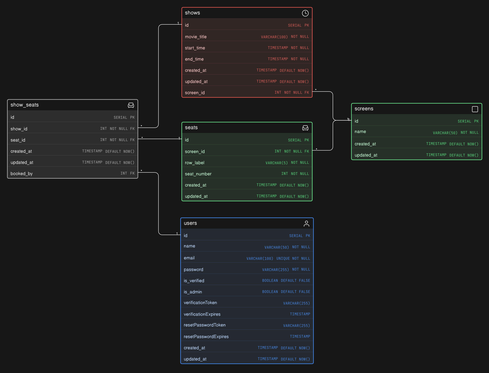
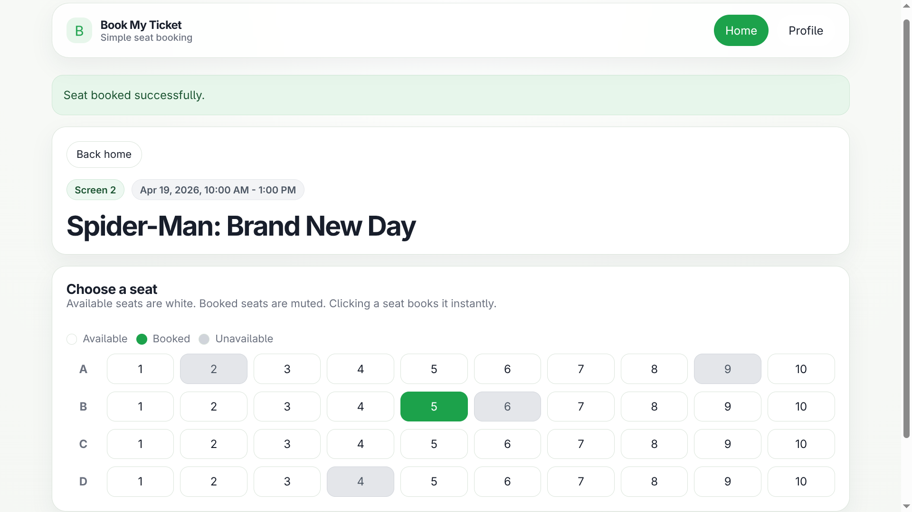
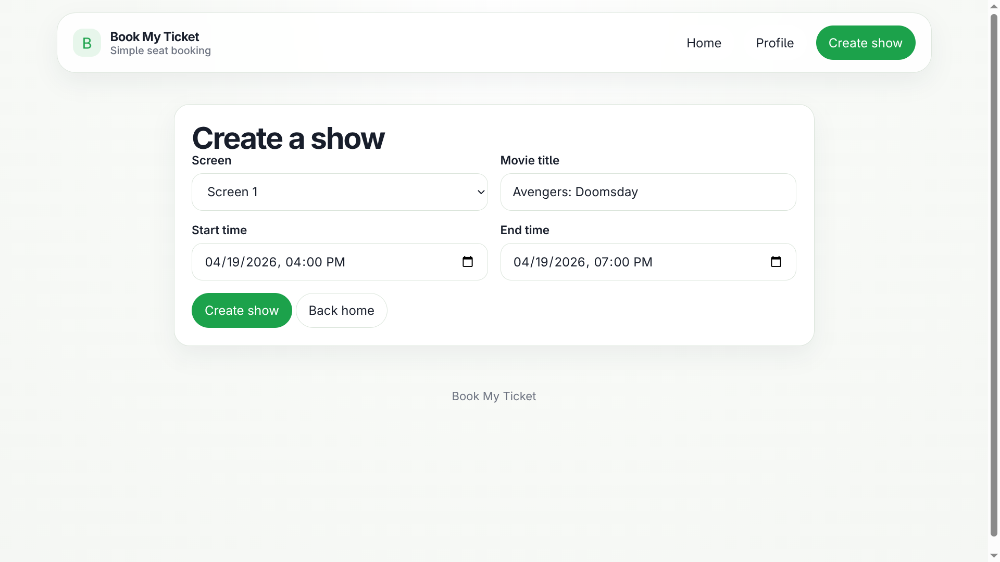

# Book My Ticket

A backend system for a theatre booking platform with a complete authentication flow using access and refresh tokens, role-based admin routes, and concurrency-safe seat booking using row-level locking to prevent double bookings. The system is designed with a clean modular structure, proper validation, and scalable architecture.

## Live Preview

https://book-my-ticket-t1uv.onrender.com

---

## Setup Instructions

1. Clone the repository

    ```bash
    git clone https://github.com/sameerbhagtani/book-my-ticket
    ```

2. Install dependencies

    ```bash
    npm install
    ```

3. Setup environment variables
   Create a `.env` file using `.env.example`

4. Start database (Docker)

    ```bash
    npm run db:up
    ```

5. Run migrations

    ```bash
    npm run db:migrate
    ```

6. Seed database with initial data

    ```bash
    npm run db:seed
    ```

7. Start the server

    ```bash
    npm run dev
    ```

---

## DB Design



- **users**: stores user credentials, roles, and verification state
- **screens**: represents theatre screens
- **seats**: defines seat layout for each screen
- **shows**: stores movie shows with timing and screen reference
- **show_seats**: maps seats to shows and tracks booking status

---

## Screenshots

### Home Page


### Booking Page



### Admin Create Show Page



---

## API Routes

### Authentication and Users

Authentication is implemented using access tokens and refresh tokens. Access tokens are short-lived and used for authorization, while refresh tokens are stored in cookies and used to generate new access tokens securely.

Prefix: `/api/users`

| Method | Route                | Description               |
| ------ | -------------------- | ------------------------- |
| GET    | /me                  | Get current user          |
| POST   | /register            | Register new user         |
| POST   | /login               | Login user                |
| POST   | /logout              | Logout user               |
| GET    | /verify-email        | Verify email              |
| POST   | /resend-verification | Resend verification email |
| POST   | /refresh             | Refresh access token      |
| POST   | /forgot-password     | Send reset password email |
| POST   | /reset-password      | Reset password            |

---

### Shows

Prefix: `/api/shows`

| Method | Route          | Description              |
| ------ | -------------- | ------------------------ |
| GET    | /              | Get all shows            |
| POST   | /              | Create show (admin only) |
| GET    | /:showId/seats | Get seats for a show     |

---

### Screens

Prefix: `/api/screens`

| Method | Route | Description     |
| ------ | ----- | --------------- |
| GET    | /     | Get all screens |

---

### Bookings

Prefix: `/api/bookings`

| Method | Route | Description                                         |
| ------ | ----- | --------------------------------------------------- |
| POST   | /     | Book a seat (authenticated and verified users only) |

---

## Booking and Concurrency Control

Seat booking is protected using database-level row locking. When a user attempts to book a seat, the system runs the operation inside a transaction and locks the specific row using SELECT FOR UPDATE.

This ensures:

- Only one user can book a seat at a time
- Concurrent requests do not lead to double booking
- Other requests either wait or fail safely

---

## Middlewares

- **getUser**: attaches user from access token if present
- **requireAuth**: ensures user is logged in
- **requireVerified**: ensures email is verified
- **requireAdmin**: restricts access to admin users

These are applied appropriately across routes to enforce security and access control.

---

## Tech Stack

- HTML
- CSS
- JavaScript
- Node.js
- Express
- PostgreSQL
- Drizzle ORM
- Zod for validation
- JWT for authentication

---

## Notes

- Access token is stored in memory on frontend
- Refresh token is stored in HTTP-only cookie
- Seat availability is derived from `show_seats` table
- No redundant status fields are used

---

This project demonstrates a clean backend architecture with proper authentication, modular design, and concurrency-safe booking logic.
